# 一. JS基础

## 0. 从2个看似 *基本* 的问题开始

### 1) 问题1: 变量相关问题

- 变量到底是什么?

- 基本类型变量与引用类型变量的区别是什么?

- 函数传参, 到底是值传递还是引用传递?    

- 给变量赋值到底做了什么?

- 有哪些改变变量值的方式?

- 如何理解下面2句重要的话(编码演示说明)?

```
- 变量到底是什么?
  - 可以变化的量, 由变量名和变量值组成, 名称是标识, 值是可以变化的
  - 一个变量对应一块小内存, 变量名是这块内存的标识名称, 用于查找这块内存, 变量的值就是内存中保存的数据
- 基本类型变量与引用类型变量的区别是什么?
  - 根据变量内存中保存的数据来区分
  - 基本类型变量: 内存中保存的基本类型的数据
  - 引用类型变量: 内存中保存的是地址值
- 给变量赋值到底做了什么?
  - 将基本类型数据赋给变量: 将数据保存在变量内存中
  - 将对象赋给变量: 将对象在内存中的地址值保存在变量内存中
  - 将另一个变量赋给变量: 将右侧变量内存中的数据(基本数据/地址值数据)拷贝保存到左侧变量内存
- 函数传参, 到底是值传递还是引用传递? 
  - 函数调用时, 是将实参变量的数据拷贝一份赋值给形参变量
  - 只是实参变量数据可能是基本类型, 也可能是引用类型的(地址值)
- 有哪些改变变量值的方式?
  - 只能通过赋值改变
  - c.m = 2: 改的是c变量指向的对象内部的属性数据, c本身没有变化的(对象内存的位置没变)
- 如何理解下面2句重要的话(编码演示说明)?
  - 2个引用变量指向同一个对象, 如果通过一个变量修改对象内部的数据 => 另一个变量也能看到原对象(新数据)
  - 2个引用变量指向同一个对象, 让其中一个变量指向一个新的对象 => 另一个引用变量看到的是老的对象
```


### 2) 问题2: 表达式a.b的内部解析流程

```
查找a: 查找变量, 沿着作用域链查找
	* 找不到 => 报错(ReferenceError/引用错误 ): a is not defined
	* 找到了: 得到a的值, 准备去.b, 但a的值不同, 处理结果不同
		* undefined/null  ==> 报错(TypeError/类型错误): 
								can not read property b of undefined/null
		* boolean/number/string基本值  ==> 创建一个包含这个值的对应的包装类型对象
		* 引用地址值 ==> 找到对应的对象 ==> 准备找b
		
查找b属性: 先在对象自身上找, 如果没找到, 沿着原型链查找
	* 找不到: 返回undefined
	* 找到了, 返回它的值(值的拷贝)

```


## 1. 作用域与闭包相关


### 1) 作用域

变量可以合法使用(查找)的范围


###  2) 作用域分类

- 全局作用域
- 函数作用域
- 块级作用域(ES6新增): const / let
  - 问题: 什么是块作用域?     非函数花括号才有块级作用域

```
for(let i=0;i<5;i++) {
	settimeout(() => {
		console.log(i)  // 01234
	}, 0)
}

```


###  3) 作用域链

多个嵌套的作用域形成的由内向外的结构, 用于查找变量(*本质是包含由内向外的多个变量对象的数组*)

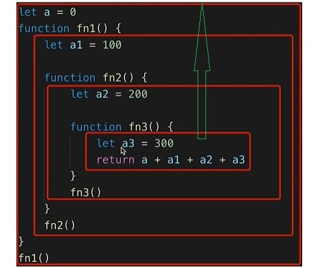


### 4) 变量提升与函数提升

- 变量提升(变量声明提升): 在变量声明语句之前, 就可以访问到这个变量(undefined)
- 函数提升(函数声明提升): 在函数声明语句之前, 就执行该函数
- 原因: 简单来说就是在执行全局代码和函数前会进行预解析/处理
  - 将var变量声明放在最前面执行
  - 将function函数声明放在最前面执行
- 函数提升 同名覆盖 ==> 变量提升, 同名的变量忽略

```
console.log(a)
var a = 3

var a
console.log(a)
a = 3

function a () {

}
a()

a.b()

```


- 区分执行函数定义与执行函数
  - 执行函数定义:  创建函数对象, 如果指定了函数名, 同时会定义变量并指向这个函数对象
  - 执行函数: 执行函数内部的语句
  - 必须先执行函数定义, 再执行函数  ===> 注意: 函数定义有可能会提升到最上面执行


### 5) 闭包

- 闭包相关问题？

  ```
  1. 是什么？
  2. 如何产生？
  3. 作用？
  4. 区别产生闭包与使用闭包？
  5. 应用？
  ```
  

  
- 理解:

  - 当嵌套的内部函数引用了外部函数的变量时就产生了闭包
  - 什么时候产生的闭包?  执行内部函数定义(创建函数对象)后

- 通过chrome工具得知: 闭包本质是内部函数中的一个对象(非js的容器), 这个容器中包含引用的变量

- 作用

  - 延长局部变量的生命周期
  - 让函数外部能操作内部的局部变量

- 写一个闭包程序

  ```js
  function fn1() {
    var a = 2;
    var b = 3
    function fn2() {
      a++;
      console.log(a);
    }
   return fn2;
  }
  var f = fn1();
  f();
  f();
  f = null
  f = 1
  
  
  function showDedelay (time, msg) {
      setTimeout(() => {
          alert(msg)
      }, time)
  }
  showDelay(1000)
  ```

  
  
- 区别闭包的三个操作

  - 产生闭包:  内部函数对象创建时产生, 包含那个被引用的变量的容器(不是js对象)
  - 使用闭包: 执行内部函数
  - 释放闭包: 让内部函数对象成为垃圾对象, 断开指向它的所有引用

- 闭包的应用: 

  - 举删除删除列表中的的某个商品的例子(带确定框)

  


### 6) this在不同场景下的取值?

- this学习的2个目标:

  - **能判断出函数中的this是谁**
  - **能控制函数的this是需要的特定对象**
- 常规情况下, 函数中的this取决于执行函数的方式

  - fn(): 直接调用  ==> **this是?**  window  无论嵌套多少层
  - new fn(): new调用 ==> **this是?**  新建的对象
  - obj.fn(): 通过对象调用 ==> **this是?**  obj  
  - fn.call/apply(obj): 通过函数对象的call/apply来调用 ==> **this是?**  obj
  - 事件的回调  this是事件源
- 特殊情况:

  - bind(obj)返回的函数  ==> **this是?**  obj
  - 箭头函数 ==> **this是?**  外部作用域的this==》 沿着作用域链去外部找this
  - 回调函数   它不是我们调用的
    - 定时器/ajax/promise/数组遍历相关方法回调  ==> **this是?**  window
    - vue控制的回调函数  ==> **this是?**  组件的实例
    - React控制的生命周期回调, 事件监听回调  ==>  **this是?**  组件对象 / undefined
- 如何控制函数的this?  

  - 利用函数的bind()
  - 利用箭头函数
  - 也可以用外部保存了this的变量
- 关于this的测试题(有问题先同学间交流)
  - http://caibaojian.com/javascript-this.html
- 另一种分析this的方式(有没兴趣/余力的可以看看)
  - https://zhuanlan.zhihu.com/p/82504422

## 2. 原型相关

### 1) 原型

- 每个函数都有一个显式原型属性: `prototype`

- 每个实例都有一个隐式原型属性: `__proto__`

- 实例的`__proto__`与对应函数的`prototype`都指向原型对象

- 默认的原型对象是Object的实例， 也就是一个{}

- 原型对象上有一个`constructor`属性指向对应的构造函数

  function Fn () {}

  const fn = new Fn()

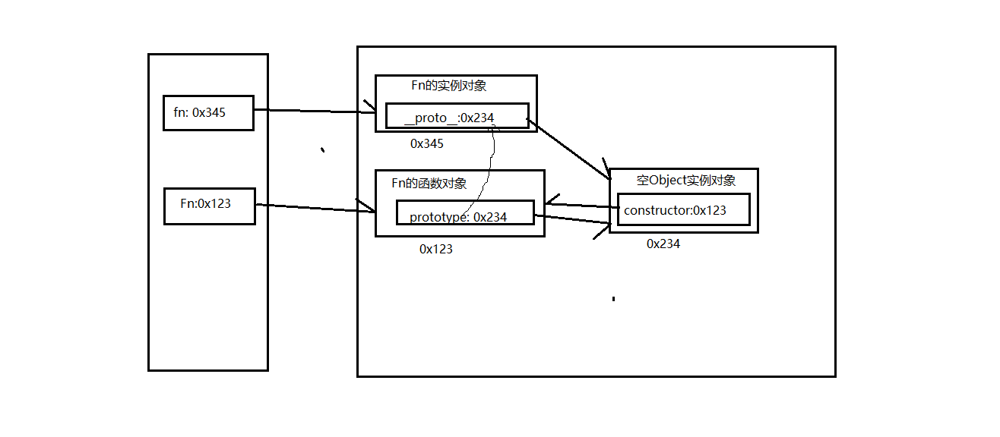

- 问题1: 区别**执行函数定义**与**执行函数**

  - 执行函数定义: 也就是去创建函数对象, 只是有可能被JS引擎提升预处理执行
  - 执行函数: 执行函数体中所有语句

- 问题2: 说说函数对象上的**prototype属性**?

  - 执行函数定义定义(有可能被提升执行)， 也就是创建函数对象

  - 给函数对象添加prototype属性, 属性值为空的Object实例对象, 也就是原型对象

  - 给原型对象添加constructor属性, 值为函数

  - 伪代码:

    ```js
    new Function()
    this.prototype = {}  // this就是函数对象
    this.prototype.constructor = this
    ```

- 问题3:  说说实例对象上的**`__proto__`属性**?

  - JS引擎在创建实例对象时内部自动执行时, 会自动给实例对象添加`__proto__`属性, 值为构造函数的 prototype属性的值

  - 伪代码:
  
    ```js
  this.__proto__ = Fn.prototype  // this是实例对象
    ```
  
    

### 2) 原型链

- 从对象的`__proto__`开始, 连接的所有对象, 就是我们常说的原型链, 也可称为`隐式原型链`

- 查找对象属性简单说: 先在自身上查找, 找不到就沿着原型链查找,如果还找不到返回undefined

  ```js
  function Foo () {}
  const f = new Foo()
  f.xxx

  查找对象的属性时是否会读取prototype属性值？  不会
  什么时候使用上prototype属性值？ 在创建实例对象时
  ```
  
  

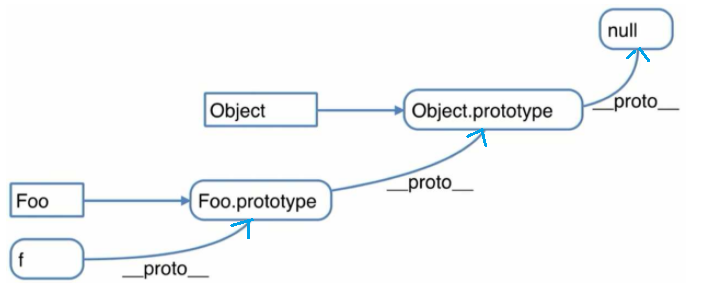


### 3) 查找对象上属性的基本流程

- 先在对象自身上查找, 如果有, 直接返回
- 如果没有, 根据`__proto__`在原型对象上查找, 如果有, 直接返回
- 如果没有根据原型对象的`__proto__`在原型对象的原型对象上查找, 一直查找到Object原型对象为止
- 如果找到了返回, 如果查找不到由于它的`__proto__`为null, 只能返回undefined


### 4) instanceof

- 作用: 判断一个任意类型对象的具体类型

- 如何判断?
  - 对于 A instanceof B
  - A是实例对象, B是构造函数
  - 如果B的prototype属性所指向的原型对象是A实例对象的原型链接上的某个对象, 返回true, 否则返回false


a instanceof Array

a instanceof Object


### 5) 原型与原型链结构图

```js
function Foo () {}
const f1 = new Foo()
const f2 = new Foo()
const o1 = new Object()
const o2 = {}

Foo instanceof Object  true
Foo instanceOf Function  true
Object instanceof Object  true
Function instanceof Function  true
Function instanceof Object  true

Object instanceof Foo
f1 instanceof Function
f1 instanceof Object
```

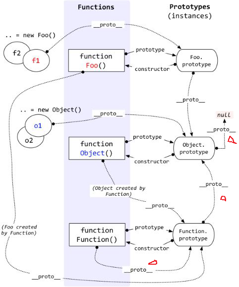


### 6) 继承

```js
/* 
使用构造函数和ES6的类设计并测试以下需要
  需求1: 
    现在2个人, 都有姓名与年龄(值自己指定), 都能自我介绍自己的姓名和年龄, 能得到当前的总人数
  需求2: 
    现在又有了一个学生, 它有身价的属性, 能介绍它的所有信息
    又有一个老师, 它有教授课程的属性, 能介绍它的所有信息
*/
```

- ***方式一: 基于构造函数的继承: 原型链 + 借用构造函数的组合式继承***
  - ***借用父类型构造函数: Person.call(this, name, age)***
  - ***让子类的原型为父类的实例: Student.prototype = new Person()***
  - ***让子类型原型的构造器为子类型: Student.prototype.constructor = Student***

```js
// 父类型
function Person(name, age) {
    this.name = name
    this.age = age
}

Person.prototype.fn = function () {}
Person.prototype.sayHello = function () {
	console.log(`我叫${this.name}, 年方${this.age}`)
}
// 子类型
function Student(name, age, price) {
    // this.name = name
    // this.age = age
    // 借用父类型的构造函数
    Person.call(this, name, age)  // 相当于执行this.Person(name, age)
    this.price = price
}
// 让子类的原型为父类的实例
Student.prototype = new Person()
// 让原型对象的构造器为子类型
Student.prototype.constructor = Student

Student.prototype.sayHello = function () {
	console.log(`我叫${this.name}, 年方${this.age}, 身价: ${this.price}`)
}

const s = new Student('tom', 23, 14000)
s.sayHello()
s.fn()
```


- ***方式二: 基于class/类的继承***
  - ***子类 extends 父类: class Teacher extends Person2***
  - ***子类构造器中调用父类的构造: super(name, age)***

```js
// 父类
class Person2 {
    constructor (name, age) {
        this.name = name
        this.age = age
    }

    fn () {}

    sayHello () {
    	console.log(`我叫${this.name}, 年方${this.age}`)
    }
}
// 子类
class Teacher extends Person2 {
    constructor (name, age, course) {
        super(name, age)
        this.course = course
    }

    // 重写父类的方法
    sayHello () {
    	console.log(`我叫${this.name}, 年方${this.age}, 课程:${this.course}`)
    }
}

const t = new Teacher('bb', 34, 'CC')
t.sayHello()
t.fn()
```

### 7) 面向对象的3大特性

- 封装: 

  - 将可复用的代码用一个结构包装起来, 后面可以反复使用
  - js的哪些语法体现了封装性: 函数 ==> 对象 ==> 模块 ==> 组件 ==> 库
  - 封装都要有个特点: 不需要外部看到的必须隐藏起来, 只向外部暴露想让外部使用的功能或数据

- 继承

  - 为什么要有继承?  复用代码, 从而减少编码
  - js中的继承都是基于原型的继承: ES6的类本质也是
  - 编码实现: 原型链+借用构造函数的组合

- 多态

  - 理解
    - 声明时指定一个类型对象, 并调用其方法, 
    - 实际使用时可以指定任意子类型对象, 运行的方法就是当前子类型对象的方法
  - JS中有多态:
    - 由于JS是弱类型语言, 在声明时都不用指定类型
    - 在使用时可以指定任意类型的数据   ==> 这已经就是多态的体现了

  ```
Java
      test (Person p) {p.sayInfo()}
      test(new Person())
      test(new Teacher())  // Teacher类型中定义的sayInfo()
      test(new Student()) // Student类型中定义的sayInfo()
      test(new Object())
  
  JS中
      function test (p) {p.sayInfo()}
      test(new Teacher())
      test(new Student())
  ```


## 3. 异步相关

### 单线程与异步

​	js是单线程的 浏览器是多线程的

- JS是单线程编程语言, 只能同时做一件事
- js引擎是在一个线程(可以称为JS线程)上解析执行js代码的, 无论是同步代码还是异步代码
- 浏览器(H5)和 nodejs 已支持通过Web Worker语法让 JS 启动分线程, 但很少使用
- JS线程与GUI线程
  - 2个不同的线程
  - JS线程负责执行JS代码, GUI线程负责渲染页面
  - 但2个线程是互斥的, 不会同时执行 (了解原因: JS 可以修改 DOM 结构)
- 界面第一次渲染: 
  - 第一套:  script宏任务 ==> 所有的微任务==> 渲染界面
  - 第二套:  取出宏队列的第一个宏任务执行==> 所有的微任务==> 渲染界面
  - 反复按第二套流程执行, 直到宏队列与微队列为空的
- 界面更新渲染: 
  - 执行第一个宏任务 => 所有的微任务==> 渲染界面 
- JS遇到需要等待 (网络请求, 定时任务) 不能卡住
- 需要异步 ==> 回调函数 (回调函数并不是所有的都是异步回调，还有同步回调)

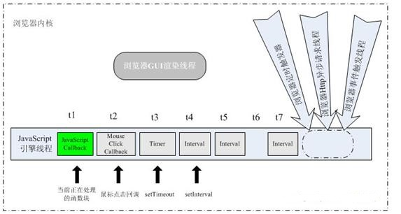

  ```html
<ul>
    <li>aaa</li>
    <li>bbb</li>
    <li>ccc</li>
</ul>
<button id="test">test</button>
<div id="content">
    aaaaaaa
</div>
<script>
    Promise.resolve().then(() => { // 微任务
        alert('promise1')
    }) 
    Promise.resolve().then(() => { // 微任务
        alert('promise2')
    }) 
    setTimeout(() => {// 宏任务
        alert(document.getElementById('content').innerHTML) 
    }, 0)
    document.getElementById('test').onclick = () => {// 宏任务
        document.getElementById('content').innerHTML = 'xxxx'  // dom渲染  
        Promise.resolve().then(() => { // 微任务
            alert('promise3')
        }) 
        setTimeout(() => {// 宏任务
            alert(document.getElementById('content').innerHTML) 
        }, 0);
    }
    
</script>
  ```


### 同步与异步

- 基于 JS 是单线程编程语言
- 同步会阻塞代码执行
- 异步不会阻塞代码执行:  ==> ajax请求, send()发异步/同步请求的对比
- 要想实现异步：需要使用回调，配和其它线程去实现


### event loop1 

- JS是通过事件循环机制来实现JS的单线程异步
- js是单线程运行的
- 异步要基于回调来实现
- event loop 就是异步回调的实现原理   

.png)

**事件循环机制的2个重要部分**

​		**在分线程执行的管理模块: 定时器/ajax/dom事件**

​		**保存待执行的回调函数的事件队列(Event queue)/任务队列(Task queue)**


### 宏任务与微任务

- 宏任务: 
  - script(整体代码)
  - setTimeout, 
  - setInterval, 
  - Ajax, 
  - DOM事件监听
  - 
  - postMessage (H5, 向其它窗口分发异步消息)
  - setImmediate(立即执行, Node.js 环境)
- 微任务: 
  - Promise, 
  - async/await, 
  - 
  - mutationobserver(H5, 监视DOM元素变化)


### 宏队列与微队列

- 宏队列: 用来保存n个宏任务的队列容器   
- 微队列: 用来保存n个微任务的队列容器


### event loop2

- js-web中的dom事件回调, 定时器回调与ajax回调异步执行, 都是基于event loop   ===> 宏任务
- H5新的MutationObserver也基于event loop   ==> 微任务
- promise成功和失败的回调也是异步执行的, 也是基于event loop  ==> 微任务
- 执行顺序:
  - 第一步: 先执行script宏任务
  - 第二步: 再依次取出微列中的所有微任务执行   ==> UI线程更新界面
  - 第三步: 再取出宏队列中第一个宏任务执行
  - 第四步: 再依次取出微列中的所有微任务执行    ==> UI线程更新界面
  - 后面重复三,四步


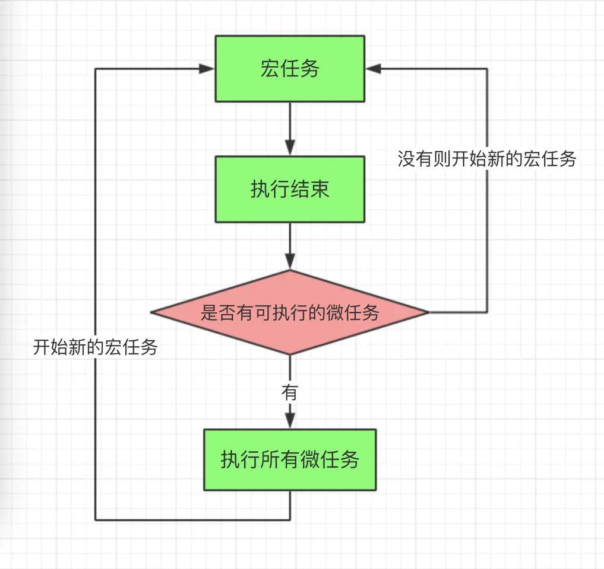

### 使用Promise解决回调地狱问题

Promise相对纯回调形式, 指定回调函数的时机更灵活(可以在发送请求后或请求结束后)

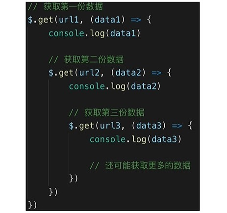

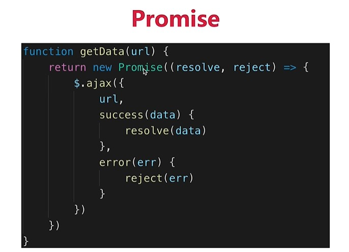


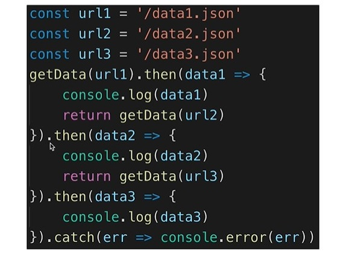

### Promise的理解

- ES6推出的新的更好的异步编程解决方案(相对于纯回调的方式)
  - 可以异步操作启动后或完成后, 再指定回调函数得到异步结果数据
  
  - 解决嵌套回调的回调地狱问题  ---promise then的链式调用
  
    ```
    
    ```
  
- promise对象有3种状态
  - pending 
  - resolved/fulfilled 
  - rejected
  
- promise状态的2种变化
  - pending --> resolved
  - pending --> rejected
  - 注意:  变化是不可逆, 且只能变一次
  
  new Promise((resolve, reject) => {
  
  ​	resolve()
  
  ​	reject()
  
  ​    throw error
  
  })

### promise的then()的理解

- then()总是返回一个新的promise
- 新promise的结果状态由then指定的回调函数执行的结果决定
  - 抛出错误
  - 返回失败的promise
  - 返回成功的promise
  - 返回其它任何值


### Promise.all([promise1, promise2, promise3])

- 问题: 
  - 如何在发送的多个请求成功后再显示数据?
  
  - 如何发3请求成功后再发第4个请求?
  
- 批量/一次性发送多个异步请求
- 当都成功时, 返回的promise才成功
- 一旦有一个失败的, 返回的promise就失败了


### async/await与promise的关系

- async/await是消灭异步回调的终极武器
- 作用: 简化promise对象的使用, 不用再使用then/catch来指定回调函数
- 它和Promise并不互斥, 两者相辅相成
- 执行async函数, 返回promise对象
- await相当于promise的then
- try...catch可捕获异常, 相当于promise的catch


### 几个面试题

#### 测试题1

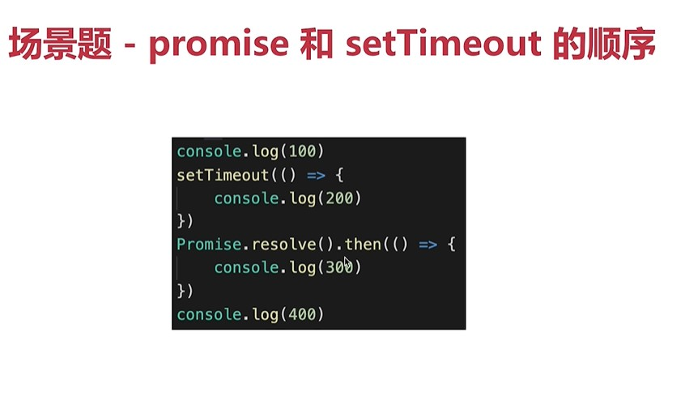

#### 测试题2

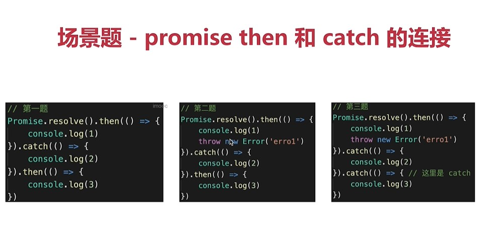

#### 测试题3

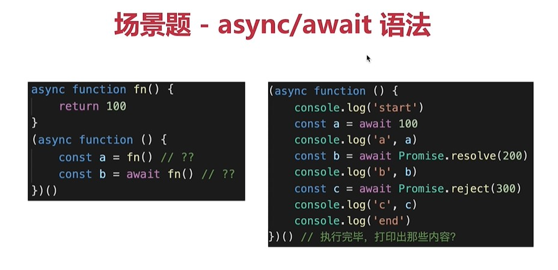

#### 测试题4

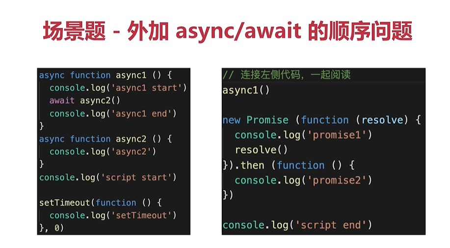

await的下面相当于是promise成功的回调，所以也是属于微任务 


#### 测试题5

```js
  setTimeout(() => {
    console.log("0")
  }, 0)
  new Promise((resolve,reject)=>{
    console.log("1")
    resolve()
  }).then(()=>{        
    console.log("2")
    new Promise((resolve,reject)=>{
      console.log("3")
      resolve()
    }).then(()=>{      
      console.log("4")
    }).then(()=>{       
      console.log("5")
    })
  }).then(()=>{  
    console.log("6")
  })

  new Promise((resolve,reject)=>{
    console.log("7")
    resolve()
  }).then(()=>{         
    console.log("8")
  })

输出: 1, 7, 2, 3, 8, 4, 6, 5, 0,
宏队: 
微队:   
callbacks:     
```


## 4. 内存管理 

- MDN文档：https://developer.mozilla.org/zh-CN/docs/Web/JavaScript/Memory_Management

### 内存的生命周期

```
1. 分配你所需要的内存
	- 定义变量  var a = 3
	- 创建对象  new Object()
	- 调用函数 fn()
2. 使用分配到的内存（读、写）
	- 读取当前值  a = a + 1
	- 设置新的值
3. 不需要时将其释放\归还
	- 函数执行完， 为当次函数执行分配的内存自动释放    栈里面的东西
	- 没有引用指向的对象， 会在某个时刻被垃圾回收器（单独线程）回收释放  堆里面的东西
	
	var obj = {}
	obj = null  // 垃圾回收器在后面的某个时间回收
```

### 垃圾回收机制

```
机制1：引用计数法
	最初级的垃圾收集算法，现在都不用了，把“对象是否不再需要”简化定义为“对象有没有引用指向它“
	每个对象内部都标记一下引用它的总个数， 如果引用个数为0时，即为垃圾对象
	var a = {}
	var b = a
	b = null
	a = null
	
	问题： 循环引用有问题
		var o1= {};
        var o2 = {};
        o1.a = o2; // o 引用 o2    引用计数为2
        o2.a = o1 // o2 引用 o     引用计数为2
        
        o1 = null   引用计数为1
        o2 = null   引用计数为1
        // 2个对象都有引用指向它， 所以都不是垃圾对象
机制2：标记-清除法
	当前垃圾回收算法的基础， 它“对象是否不再需要”简化定义为“对象是否可以获得”
	从根对象（也就是window)开始查找所有引用的对象， 并标记为‘使用中’，没有标记为使用中的对象就是垃圾对象
	循环引用的对象也可能是垃圾对象
		var o1= {};
        var o2 = {};
        o1.a = o2; // o 引用 o2
        o2.a = o; // o2 引用 o
        
        o1 = null
        o2 = null
        // 通过window找不到这2个对象， 它们就没有被标记为‘使用中‘，就当作垃圾对象回收释放
```

### 内存溢出

```
运行程序需要分配的内存超过了系统能给你分配的最大剩余内存 ==》 抛出内存溢出的错误，程序中断运行
	const arr = []
    for (let index = 0; index < 100000000; index++) {
      arr[index] = new Array(1000)
    }
```


### 内存泄露

```
当程序中的某个内存数据不再需要使用， 而由于某种原因， 没有被释放 ==》 称之为“内存泄露”了
导致内存泄露的原因有下面几种常见情况：
1. 意外的全局变量
	function fn () (
		a = new Array(100000)
	)
	fn()
	
2. 没有及时清除的定时器
	this.intervalId = setInterval(() => {}, 1000)
	// clearInterval(this.intervalId)
3. 没有及时解绑的监听
	this.$bus.$on('xxx', this.handle)
	// this.$bus.$off('xxx')
4. 没有及时释放的闭包
	
```

