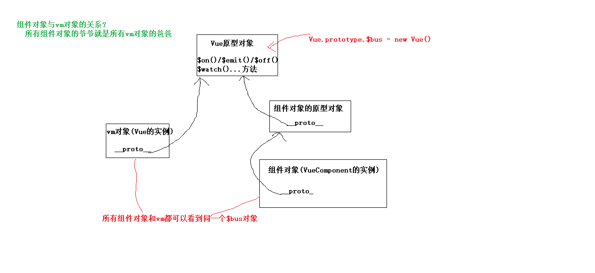

# Vue组件间通信(传值/数据)

## 通信方式列表:

	1) props
	2) vue自定义事件
	3) 全局事件总线 / pubsub(在vue开发中基本不用)
	4) v-model
	5) .sync
	6) $attrs与$listeners   与哪2个语法配合使用?    v-bind / v-on
	7) $refs & $children & $parent
	8) provide与inject
	9) Vuex
	10) 插槽 ==> 作用域插槽


## 组件间关系

```
父子
祖孙
兄弟
远亲(其它)
```


## 根据通信的2个组件间的关系来选择一种通信方式

	1) 父向子
		props(非函数)
		v-model
		$refs, $children
		插槽
	2) 子向父
		props(函数)	
		vue自定义事件
		v-model
		.sync     
		$parent
		作用域插槽
	3) 祖孙间
		$attrs与$listeners    与v-bind/v-on配合使用
		provide与inject
	4) 兄弟或其它/任意
		全局事件总线
		Vuex

## 1. props
    1) 实现父向子通信: 属性值是非函数
    2) 实现子向父通信: 属性值是函数
    3) 应用: 最基本, 用得最多的方式

## 2. vue自定义事件
    1) 实现子组件向父组件通信
    2) 相关语法:
        父组件中绑定自定义事件监听:
          <Child @eventName="callback($event)">
          child.$on('eventName', callback)
        子组件中分发事件
          this.$emit('eventName', 2)
    3) 应用:   
    	elment-ui的组件的事件监听语法都用的是自定义事件   <el-button @click="test">
        我们项目中的组件也用了不少自定义事件

## 3. 全局事件总线   

消息订阅与发布(也就是pubsub)功能类似, 但在vue项目中不使用   

```
1) 实现任意组件间通信
2) 编码:
    将入口js中的vm作为全局事件总线对象: 
        beforeCreate() {
            Vue.prototype.$bus = this
        }
    传递数据的组件分发事件: this.$bus.$emit('eventName', data)
    接收数据的组件处理监听: this.$bus.$on('eventName', (data) => {})
3) 应用: 
	前台项目中使用全局事件总线
```



VueComponent.prototype = Object.create(Vue.prototype)

## 4. v-model

    1) 实现父子之间相互通信/同步
    2) 组件标签上的v-model的本质: 动态value属性与自定义input监听(接收子组件分发的数据更新父组件数据)
        父组件: 
            <CustomInput v-model="name"/>
            <!-- 等价于 -->
            <CustomInput :value="name" @input="name=$event"/>
        子组件: 
            <input type="text" :value="value" @input="$emit('input', $event.target.value)">
            props: ['value']
    3) 应用
    	element-ui中的表单项相关组件都用了v-model: Input / Select / Checkbox / Radio

## 5. .sync
    1) 在原本父向子的基础上增加子向父
    2) 组件标签的属性上使用.sync的本质: 通过事件监听来接收子组件分发过来的数据并更新父组件的数据
        父组件:
            <child :money.sync="total"/>
            <!-- 等价于 -->
            <Child :money="total" @update:money="total=$event"/>
    
            data () {
              return {
                total: 1000
              }
            },
        子组件:
            <button @click="$emit('update:money', money-100)">花钱</button>
            props: ['money']
    3) 应用:  
        element-ui在有显示隐藏的组件上: Dialog / Drawer
## 6. $attrs与$listeners
    1) $attrs
        实现当前组件的父组件向当前组件的子组件通信(祖孙间通信)
        它是包含所有父组件传入的标签属性(排除props声明, class与style的属性)的对象
        使用: 通过 v-bind="$attrs" 将父组件传入的n个属性数据传递给当前组件的子组件
    2) $listeners
        实现当前组件的子组件向当前组件的父组件通信 (孙向祖通信)
        $listeners是包含所有父组件传入的自定义事件监听名与对应回调函数的对象
        使用: 通过v-on="$listeners" 将父组件绑定给当前组件的事件监听绑定给当前组件的子组件
    3) 应用 
    	利用它封装了一个自定义的带hover文本提示的el-button

## 7. $refs & $children & $parent
    1) $refs
        实现父组件向指定子组件通信
        $refs是包含所有有ref属性的标签对象或组件对象的容器对象
        使用: 通过 this.$refs.child 得到子组件对象, 从而可以直接更新其数据或调用其方法更新数据
    2) $children
        实现父组件向多个子组件通信
        $children是所有直接子组件对象的数组
        使用: 通过this.$children 遍历子组件对象, 从而可以更新多个子组件的数据
    3) $parent
        实现子组件向父组件通信
        $parent是当前组件的父组件对象
        使用: 通过this.$parent 得到父组件对象, 从而可以更新父组件的数据
    4) 应用 
    	在后台管理项目中使用了$refs

## 8. provide与inject
	1) 实现祖孙组件间直接通信
	2) 使用
		在祖组件中通过provide配置向后代组件提供数据
		在后代组件中通过inject配置来声明接收数据
	3) 注意:
		不太建议在应用开发中使用, 一般用来封装vue插件
		provide提供的数据本身不是响应式的 ==> 父组件更新了数据, 后代组件不会变化
		provide提供的数据对象内部是响应式的 ==> 父组件更新了数据, 后代组件也会变化
		方法二:
			祖: 定义返回数据的方法, 通过provide提供这个方法
			后代: 注入这个方法, 定义计算属性返回这个方法返回的数据
	4) 应用: 
		element-ui中的Form组件中使用了provide和inject

## 9. Vuex
    1) 实现任意组件间通信
    2) Vuex 是一个专为 Vue 应用程序设计的管理多组件共享状态数据的 Vue 插件
        任意组件都可以读取到Vuex中store的state/getters对象中的数据
        任意组件都可以通过dispatch()或commit()来触发store去更新state中的数据
        一旦state中的数据发生变化, 依赖于这些数据的组件就会自动更新
    3) 应用
    	前台和后台项目都有用vuex管理组件数据 

## 10. 插槽  ==> 作用域插槽slot-scope/v-slot
    1) 实现父组件向子组件传递标签内容
    2) 什么情况下使用作用域插槽?
        父组件需要向子组件传递标签结构内容
        但决定父组件传递怎样标签结构的数据在子组件中
    3) 编码:
        子组件:
            <slot :row="item" :$index="index">  <!-- slot的属性会自动传递给父组件 -->
            </slot>
        父组件:
            <template slot-scope="{row, $index}">
            <template v-slot="{row, $index}">
                <span>{{$index+1}}</span> &nbsp;&nbsp;
                <span :style="{color: $index%2===1 ? 'blue' : 'green'}" >{{row.text}}				</span>
            </template>
    4) 应用
    	element-ui中绝大部分组件都用了插槽
    	element-ui中的 table-column 组件使用了作用域插槽


## 路由组件间通信方式?

```
query参数
params参数
props(需要配置, 而不是标签属性)
meta(也是配置)
vuex
```

